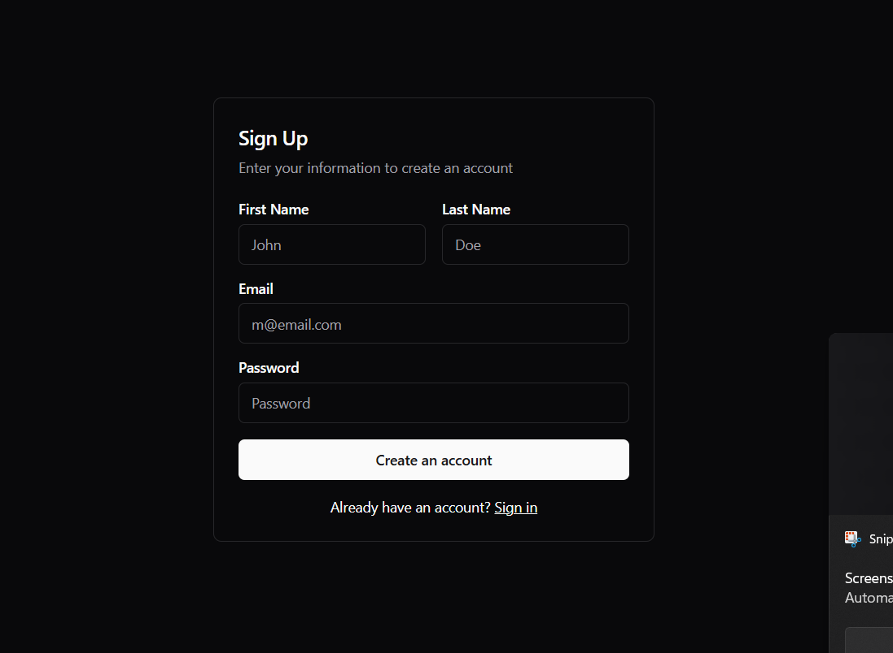
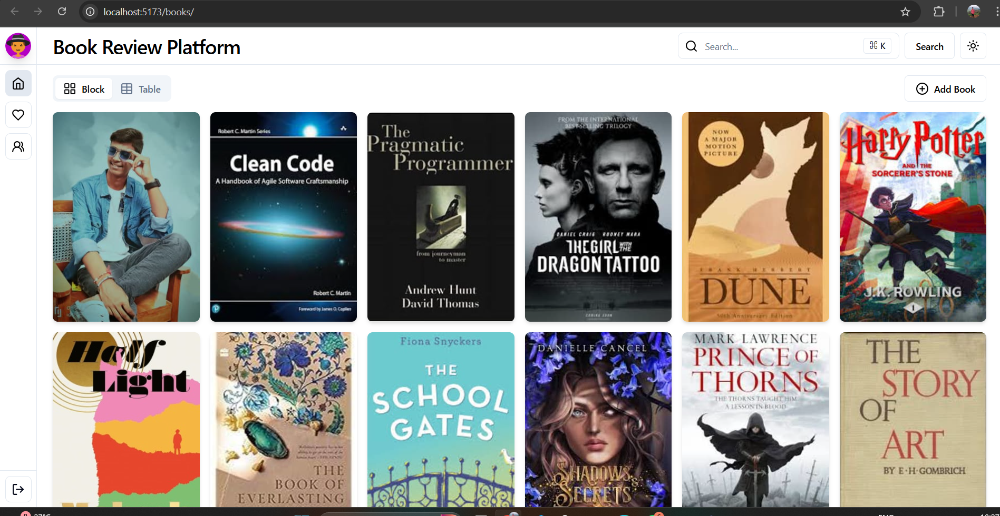
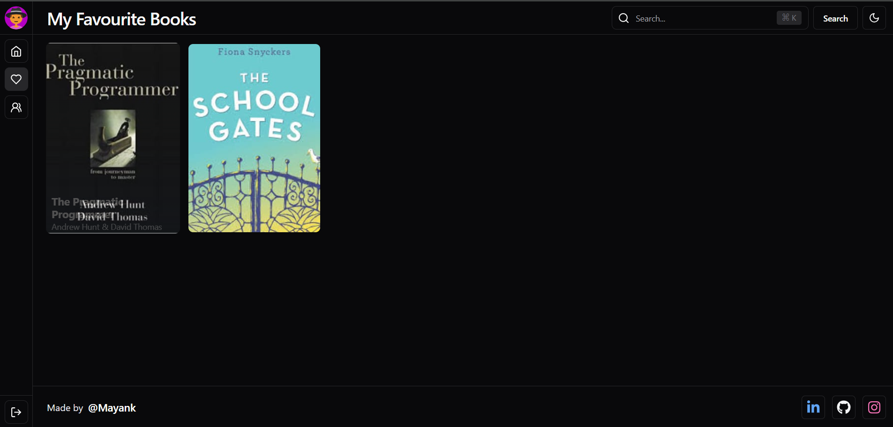
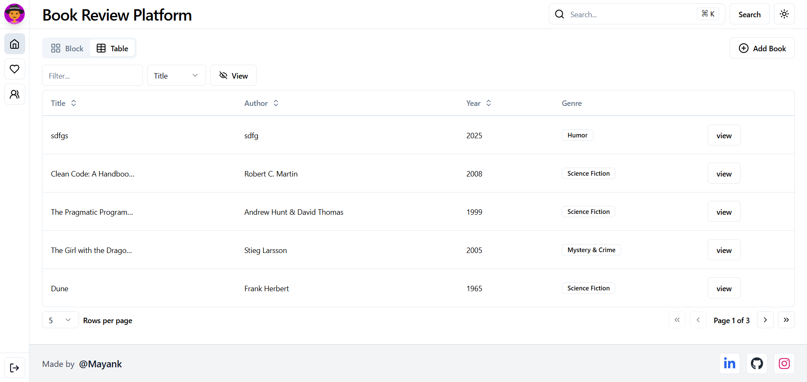
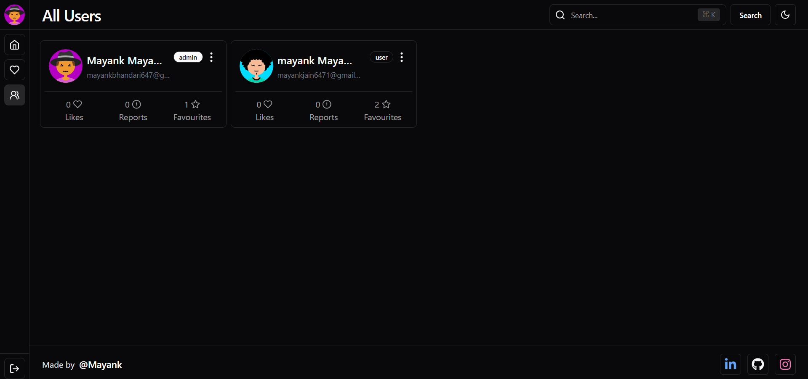

# 📚 Book Review Platform (MERN)

A fullstack **MERN Book Review Platform** where users can sign up, log in, add books, and write reviews.  
This project demonstrates **authentication, CRUD operations, protected routes, MongoDB Atlas integration, and frontend integration**.

---

## 🚀 Features

### 🔑 User Authentication
- User signup with **hashed password (bcrypt)**
- User login with **JWT authentication**
- Middleware to protect private routes
- JWT stored in localStorage for frontend

### 📘 Book Management
- Add new books (Title, Author, Description, Genre, Published Year)
- Edit & Delete books (only admin can modify their book)
- View all books with **cover page**
- Search & Filter books by title, author, or genre (bonus)

### ✍️ Review System
- Add reviews (rating 1–5 + review text)
- Edit/Delete own reviews
- Show all reviews per book
- **Average rating** calculated dynamically

### 🖥️ Frontend Pages
- Signup Page – create account
- Login Page – authenticate user
- Book Details Page – see book info + reviews
- Add/Edit Book Page – manage books (authenticated users only)
- Favourite Books Page – mark & view favourite books
- userDetail page- details of the user
- Users Page (Admin) – manage users
- Profile Page (optional)

### 🌟 Bonus Features
- Dark/Light mode toggle
- Table & Card view for books
- Deployment (Netlify + Render/Heroku)
- Postman collection for API testing

---

## 🛠️ Tech Stack

**Frontend:**
- React.js
- Recoil for State Management
- Tailwind CSS
- Shadcn UI library
- React Hook Form
- Tanstack Tables
- Lucide-React for icons

**Backend:**
- Node.js
- Express.js
- MongoDB
- Mongoose for MongoDB object modeling
- Multer for handling multipart/form-data
- CORS for Cross-Origin Resource Sharing
- JWT for token-based authentication
- Bcrypt for secure password storage

**Other Dependencies:**
- Axios
- Zod for schema validation
- React Router DOM for routing
- Cloudinary for image uploads (optional)
---

**Installation Guide**

---

## ⚙️ Setup Instructions

### 1️⃣ Clone Repository
```bash
git clone https://github.com/Mayankjain995/Book_review_Platform.git
cd Book_review_Platform
```

### 2️⃣ Setup Backend
cd backend
npm install

Create .env file inside /backend:
MONGO_URI=your_mongodb_atlas_uri
JWT_SECRET=your_secret_key
PORT=5000

### 3 Run Server
npm start
cd ../frontend
npm install

Create .env file inside /frontend:
VITE_BACKEND_URL=http://localhost:5000
VITE_GOOGLE_CLIENT_ID=your_google_oauth_client_id (optional)

Run client:
npm run dev

## 📸 Screenshots


### 🧑 Signup



### 🔑 Login


### 🏠 Homepage



### 📝 Book Details


### ⭐ Favourite Books



### 📊 Table View



### 👥 Users (Admin)



📡 API Endpoints

Auth Routes

- POST /api/users/signup → Register new user
 - POST /api/users/login → Login + get JWT

Book Routes

- GET /api/books → Get all books (with pagination)
- POST /api/books → Add new book (auth required)
- PUT /api/books/:id → Edit book (only creator)
- DELETE /api/books/:id → Delete book (only creator)

Review Routes

- POST /api/books/:id/reviews → Add review
- PUT /api/reviews/:id → Edit review
- DELETE /api/reviews/:id → Delete review

✅ Deliverables

 - Full MERN stack project
 - JWT authentication & bcrypt
 - Book CRUD + pagination
 - Review system with ratings
 - React frontend with protected routes
 - MongoDB Atlas with schema design
 - README with setup instructions + screenshots


👨‍💻 Author

Mayank
📧 mayankbhandari647@gmail.com

🔗 LinkedIn
https://www.linkedin.com/in/mayank-btech-cse/

Github:-
https://github.com/Mayankjain995

---


